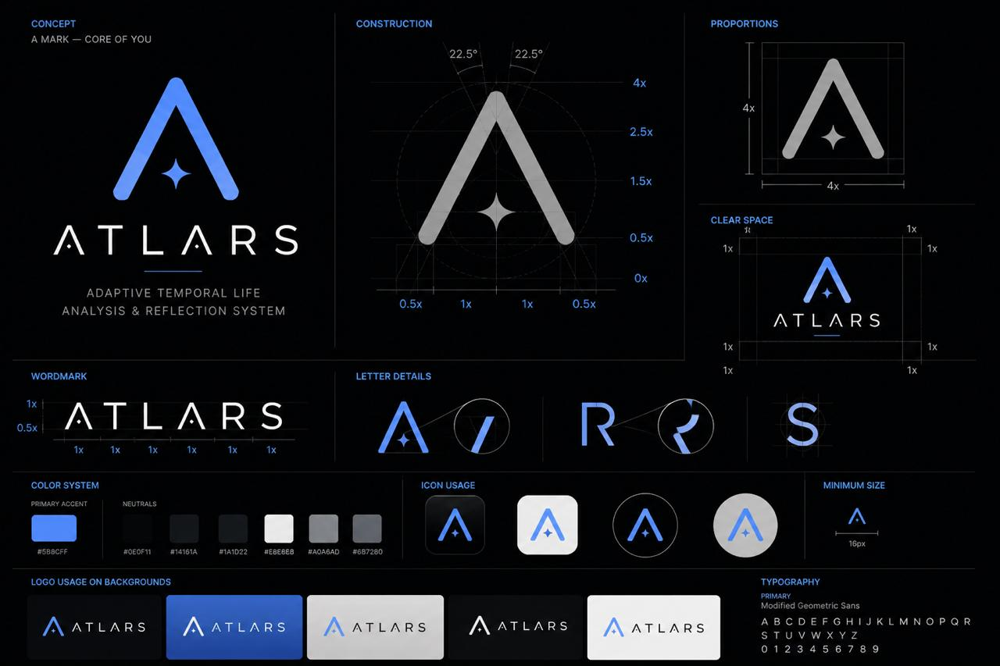

# ATLARS

<p align="center">
  
</p>

### Adaptive Temporal Life Analysis & Reflection System

> A personal identity intelligence framework. Not a chatbot. Not a content tool. A longitudinal data system that treats your inner life as a dataset worth collecting, analyzing, and understanding over time.

[](LICENSE)
[](CONTRIBUTING.md)
[](https://github.com/TheHustleHouse-HQ/atlars/graphs/contributors)
[](https://github.com/TheHustleHouse-HQ/atlars/issues?q=is%3Aissue+is%3Aopen+label%3A%22good+first+issue%22)

---

## What Is ATLARS?

Most "personal AI" tools make the same mistake: they treat the user as a prompt, not as a subject. The output is always content. Nothing accumulates. Nothing learns. The system resets after every session.

**The real problem is self-opacity.** People don't know how they've changed. They don't know which of their beliefs contradict each other. There is no tool that treats a person's inner life as data worth collecting and analyzing over time.

ATLARS fixes that. It is:

- **A temporal data system** — every entry is timestamped and the system understands time
- **A pattern extraction engine** — recurring themes, values, beliefs, and decision styles
- **A contradiction mapper** — inconsistencies are data, not errors
- **An identity evolution tracker** — who were you three months ago vs. today?
- **A framework, not a product** — designed to run for any user in isolated namespaces

It is not a social media tool. It is not a chatbot wrapper. It is a scientific instrument for self-knowledge.

---

## The Four Pillars

```
CAPTURE → STORE → SYNTHESIZE → REFLECT
```

| Pillar | Function |
|--------|----------|
| **Capture** | Text entry, voice notes, prompted micro-entries, decision logs |
| **Store** | MongoDB documents + Atlas Vector Search embeddings + Life Graph |
| **Synthesize** | Trait extraction, contradiction detection, temporal delta compute |
| **Reflect** | Identity snapshots, evolution reports, focus recommendations |

---

## Core Systems

### 🧠 Digital Life Graph
A temporal knowledge graph where nodes are entities from your life (people, places, projects, beliefs, emotions, goals) and edges are dated typed relationships. Makes questions like *"what led to my burnout last October?"* computationally answerable.

### 🌡️ Life Domain Engine
Scores 8 life domains (Work, Relationships, Health, Creativity, Social, Learning, Finance, Meaning) on activity and wellbeing. Generates weekly focus recommendations from your own historical patterns — not generic advice.

### 📦 Context Compression Protocol
Tiered memory (Hot → Warm → Cold → Permanent) with user-controlled compression review. You approve every summary before raw data archives. You mark what you never want forgotten.

### ⚡ OpenRouter Multi-Model Routing
Cost-optimized: 80%+ of processing runs on free-tier models (Gemini Flash, Llama 3.1 8B). Deep synthesis only touches paid models once a month. Estimated cost: $0.50–$2.00/user/month.

---

## Tech Stack

| Layer | Technology |
|-------|------------|
| Backend | FastAPI (Python) |
| Database (dev) | MongoDB in Docker — zero signup required |
| Database (prod) | MongoDB Atlas |
| Vector Search | MongoDB Atlas Vector Search |
| Job Queue | Celery + Redis |
| Transcription | whisperX |
| Entity Extraction | GLiNER2 |
| LLM Routing | OpenRouter |
| Auth | JWT + expo-secure-store refresh tokens |
| Mobile App | React Native (Expo, TypeScript) |
| Distribution | Apple App Store + Google Play Store |
| Backend Deployment | Docker Compose (self-host) or cloud VPS |

---

## Quick Start (Local)

### Backend (required for all contributors)

```bash
# Clone
git clone https://github.com/TheHustleHouse-HQ/atlars.git
cd atlars

# Copy environment template and add your OpenRouter API key
cp .env.example .env

# Start backend services: MongoDB, Redis, FastAPI, Celery worker
docker compose -f docker-compose.dev.yml up

# Seed the database with a test user and sample entries
python scripts/seed_dev.py
```

Backend API is live at `http://localhost:8000/docs`

No MongoDB Atlas account required for local development.

### Mobile App (frontend contributors)

```bash
cd mobile

# Install dependencies
npm install

# Start Expo dev server
npx expo start
```

Then press `i` to open in iOS Simulator, `a` for Android emulator, or scan the QR code with the Expo Go app on your physical device.

The app connects to `http://localhost:8000` by default in development.

---

## Project Status

ATLARS is currently in **Phase 0 — Scaffold** (complete). Phase 1 is now open for contributors.

**Phase 0 — Scaffold** ✅
- [x] Architecture finalized
- [x] Personality framework decided (OCEAN + 8 Life Domains + Life Stage)
- [x] Full MongoDB data model designed
- [x] API contract defined
- [x] Codebase folder structure planned
- [x] Docker Compose setup (MongoDB + Redis + FastAPI + Celery)
- [x] FastAPI skeleton + auth (register, login, refresh, logout)
- [x] MongoDB connection layer (Motor async)
- [x] Expo mobile scaffold (auth screens, token management, tab navigation)

**Phase 1 — Capture** 🚧 In Progress
- [ ] Text entry CRUD — `POST/GET/PATCH/DELETE /entries/`
- [ ] Voice entry upload + whisperX transcription
- [ ] Embedding service — nomic-embed-text via OpenRouter
- [ ] Journal screen (mobile)

**Phase 2 — Synthesize** · **Phase 3 — Reflect** · **Phase 4 — Query** · **Phase 5 — Polish** are queued.

Track everything on the [Project Board](https://github.com/TheHustleHouse-HQ/atlars/projects).

---

## 🌟 ATLARS Contributor Program

**This is more than a codebase. It's a talent pipeline.**

ATLARS is built by [The Hustle House](https://github.com/TheHustleHouse-HQ). We built the contributor program because the best way to find exceptional people is to work with them — not to interview them.

### Milestones

| Milestone | What You Get |
|-----------|-------------|
| First merged PR | Added to Contributors list in README |
| 5+ quality contributions | Digital badge on Credly (shareable on LinkedIn) |
| 10+ quality contributions | **ATLARS Contributor Certificate** — issued by The Hustle House |
| Top contributor of the month | **Internship consideration** (3 spots per month) |
| Internship → performance | **Full-time offer pathway** |

### How to Get Started

1. Read [`CONTRIBUTING.md`](CONTRIBUTING.md) fully
2. Read [`docs/ARCHITECTURE.md`](ARCHITECTURE.md) to understand the system
3. Pick an issue labeled [`good first issue`](https://github.com/TheHustleHouse-HQ/atlars/issues?q=is%3Aopen+label%3A%22good+first+issue%22)
4. Comment on the issue to claim it
5. Submit your PR and engage in review

---

## Documentation

| Doc | Description |
|-----|-------------|
| [`ARCHITECTURE.md`](ARCHITECTURE.md) | Full system architecture — auth, orchestration, data model overview |
| [`docs/ROADMAP.md`](docs/ROADMAP.md) | Phase-by-phase build plan with exact deliverables and open issues |
| [`docs/DATA_MODEL.md`](docs/DATA_MODEL.md) | Full MongoDB schema — every collection, field, index |
| [`docs/API.md`](docs/API.md) | API contract reference — all routes, request/response shapes |
| [`docs/FOLDER_STRUCTURE.md`](docs/FOLDER_STRUCTURE.md) | Codebase layout and placement rules for contributors |
| [`docs/MOBILE_RELEASE.md`](docs/MOBILE_RELEASE.md) | App Store + Play Store release process |
| [`PHILOSOPHY.md`](PHILOSOPHY.md) | Why this exists and what makes it different |
| [`CONTRIBUTING.md`](CONTRIBUTING.md) | How to contribute + the contributor program |
| [`SECURITY.md`](SECURITY.md) | Security policy + responsible disclosure |

---

## License

Apache License 2.0 — see [`LICENSE`](LICENSE)

Copyright © 2026 The Hustle House. All rights reserved.

The ATLARS name, logo, and brand identity are trademarks of The Hustle House and may not be used without written permission.

---

## Maintainers

| Role | GitHub |
|------|--------|
| Lead Maintainer | [@thhteamspace](https://github.com/thhteamspace) |

---

*Built on the belief that self-knowledge is the highest form of intelligence.*
